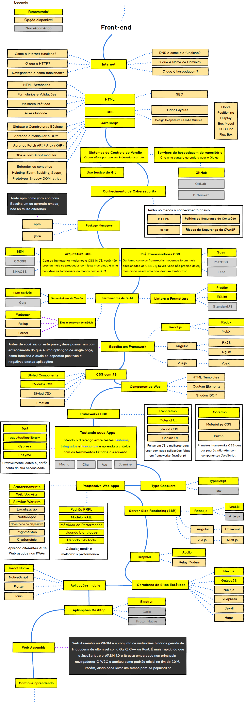
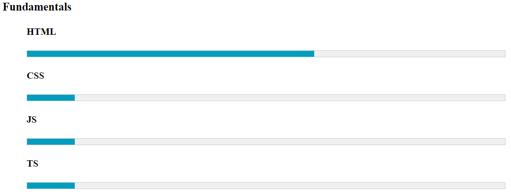
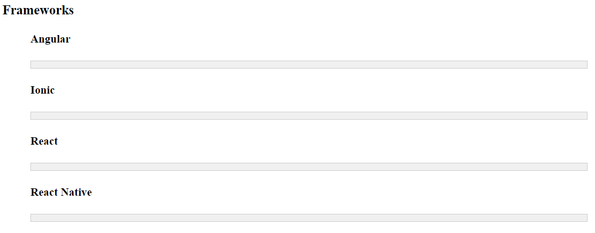
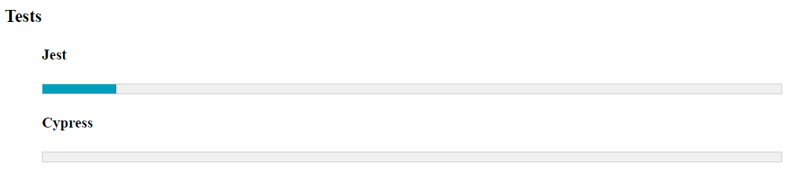

## Estudos Front-End

Este repositório foi criado por mim com o objetivo de construir uma base sólida em desenvolvimento frontend para mobile e web. Aqui, armazenarei os conhecimentos adquiridos, abrangendo todos os aspectos necessários para o desenvolvimento de soluções eficientes e modernas nessas áreas desde o básico até o avançado. Usarei como base para essa jornada como guia a trilha desenvolvida pela [comunidade](https://github.com/arthurspk/guiadofrontend):



## Sumário

1. [Descrição](#descrição)
2. [Dominio](#dominio)
3. [Distintivos](#distintivos)
4. [Visuais](#visuais)
5. [Estrutura do Projeto](#estrutura-do-projeto)
6. [Plataformas Utilizadas para Aprendizado](#plataformas-utilizadas-para-aprendizado)
7. [Ferramentas Utilizadas](#ferramentas-utilizadas)
8. [Autores e Reconhecimento](#autores-e-reconhecimento)
9. [Licença](#licença)
10. [Status do Projeto](#status-do-projeto)

## Descrição

Este repositório é uma iniciativa para que eu possa criar de fato um histórico concreto das tecnologias que eu domino e utilizo no meu dia-a-dia. Ou seja, aqui está centralizado tudo que eu domino em relação a desenvolvimento frontend.

A forma como este repositório está organizado facilita a utilização dos projetos desenvolvidos como base para demonstrar as tecnologias nas quais possuo expertise.

## Dominio

O gráfico a seguir exibe de forma macro minha autoavaliação em relação ao domínio das linguagens e frameworks que estudei e armazenei neste repositório.





## Distintivos


## Visuais

## Estrutura do Projeto

Este repositório está organizado da seguinte forma:

```plaintext
.
|-- 01-fundamentals
│   |-- css
│   |-- html
|   |-- javascript
|-- 02-exercises
|   |--algorithms
|       |-- online-courses
|       |-- university
|-- 03-frameworks
│   |-- ionic
│   |-- angular
|-- 04-projects
```

**Explicação**:

- Para o diretório de **_fundamentals_** está todo material prático desenvolvido por mim para estudar os fundamentos das tecnologias frontend para web e mobile. Aqui temos as principais tecnologias envolvidas para o desenvolvimento **_web_** e **_mobile_**, **_htmt_**, **_css_** e **_javascript_**.

- Para o diretório de **_exercises_** está armazenado pequenos exercicios para por em prática
  todo conhecimento adquirido em **_fundamentals_**. Aqui temos exericicios de algoritimos na pasta **algorithms**, que é divido em **_online-couses_** para exercicios realizados em plataformas digitais e **_university_** para exercicios realizados nas aulas de programação em graduações.

- Para o diretório de **_frameworks_** está todo material prático desenvolvido por mim para estudar os principais frameworks. Aqui temos os principais **_frameworks_** envolvidos para o desenvolvimento **_web_** e **_mobile_**, **_Angular_** e **_Ionic_**.

- Para o diretório de **_projetcs_** estão armezados todos os minis projetos práticos usando o conhecimento adquirido em **_fundamentals_**, **exercises** e **_frameworks_**, desenvolvido por mim para por em prática esses conhecimentos. Na pasta **daily-challeng** temos projetos desenvolvidos em um dia baseado em protótipos de telas. Na pasta **consumed-apis** estão projetos que integram com apis gratuítas e que consomem essas apis e disponibilizo esses dados em projetos frontend.

## Plataformas Utilizadas para Aprendizado

### **_Fundamentals_**

- **_[W3schools](https://www.w3schools.com/)_**

### **_Exercises_**

- **_[Bandtec - Algorithms Class](https://www.sptech.school/)_**

### **_Projects_**

- **_[Icode This](https://icodethis.com/app?ref=app-ideas)_**
- **_[Public API'S](https://publicapis.dev/)_**

### **_Tests_**

- **_[Erick Wendel](https://play.ewacademy.com.br/)_**

## Ferramentas Utilizadas

- [Validar Documentos HTML](https://validator.w3.org/)

## Autores e Reconhecimento

Atualmente, estou reforçando meu conhecimento, revisitando conceitos e práticas para garantir um domínio completo dessas tecnologias. Apesar da minha ampla experiência, estou me dedicando a este esforço pessoalmente para assegurar a excelência e compreensão.

Gostaria de expressar minha gratidão a todos que contribuíram para a construção deste conhecimento, incluindo professores da faculdade e outros mentores ao longo do caminho.

## Licença

[GAMELEIRA STUDY](LICENSE.md)

## Status do Projeto

O projeto está **ativo** e em constante **desenvolvimento**!

Essa repositório começou em **20 de junho de 2024** com o objetivo de desenvolver um conhecimento sólido sobre as tecnologias essenciais e principios para o desenvolvimento frontend. Planejo alcançar essa meta até **31 de dezembro de 2034**. Para isso realizarei estudos em plataformas web, cursos e graduações presenciais e a distancia para construir esse projeto.
